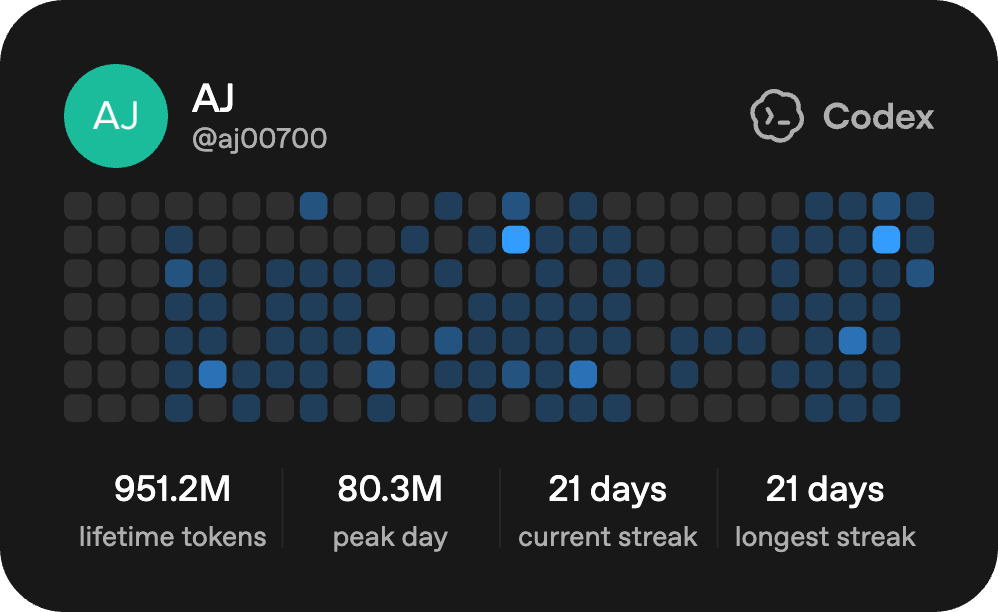

<!-- GitHub Profile README for Anshul-24git -->

<div align="center">

# Anshul Joshi

### Software Engineer building AI-native backend systems, automation platforms, and developer tools.

<a href="https://github.com/Anshul-24git?tab=repositories">
  
</a>
<a href="https://www.linkedin.com/in/anshul-joshi24/">
  
</a>
<a href="https://github.com/Anshul-24git">
  
</a>

</div>

---

## 👋 About Me

I build practical software systems that turn messy workflows into clear, reliable products.

My work is strongest around **Python/FastAPI backends, TypeScript/React dashboards, workflow automation, AI-assisted tools, data pipelines, and operational systems**.

Currently focused on:

- AI-native developer tooling and CI automation
- Backend-heavy full-stack products
- Workflow automation for jobs, contracts, leads, and email intelligence
- Dashboards that make complex systems easy to understand and act on

---

## 🚀 Featured Builds

<table>
  <tr>
    <td width="50%" valign="top">
      <h3><a href="https://github.com/Anshul-24git/justpaid-contractops-command-center">ContractOps Command Center</a></h3>
      <p><b>AI-assisted command center for contract operations.</b></p>
      <p>Turns contract/account context into explainable readiness decisions, risk signals, Slack-ready action packages, and execution briefings.</p>
      <p><b>Stack:</b> FastAPI, React, TypeScript, Pydantic, Slack API, OpenAI-ready workflows</p>
    </td>
    <td width="50%" valign="top">
      <h3><a href="https://github.com/Anshul-24git/mini-ci-agent">Mini CI Agent</a></h3>
      <p><b>AI-powered self-healing CI workflow.</b></p>
      <p>Runs CI in a sandbox, analyzes failing logs, proposes patches, applies fixes, and re-runs checks with traceable execution steps.</p>
      <p><b>Stack:</b> Next.js 15, TypeScript, Vercel Sandbox, OpenAI, CI automation</p>
    </td>
  </tr>
  <tr>
    <td width="50%" valign="top">
      <h3><a href="https://github.com/Anshul-24git/job-monitoring">Job Monitoring System</a></h3>
      <p><b>Automated job monitoring and alerting platform.</b></p>
      <p>Tracks ATS job boards, filters software roles, deduplicates with SQLite, sends email alerts, and provides a local dashboard.</p>
      <p><b>Stack:</b> Python, Playwright, SQLite, ATS APIs, YAML config, email automation</p>
    </td>
    <td width="50%" valign="top">
      <h3><a href="https://github.com/Anshul-24git/leadsignal-email-finder">LeadSignal Email Finder</a></h3>
      <p><b>Lead discovery and email enrichment workbench.</b></p>
      <p>Parses lead input, generates candidate email patterns, validates DNS/MX signals, ranks confidence, persists leads, and exports CSVs.</p>
      <p><b>Stack:</b> FastAPI, React, SQLite, DNS/MX validation, CSV export</p>
    </td>
  </tr>
  <tr>
    <td width="50%" valign="top">
      <h3><a href="https://github.com/Anshul-24git/email-verifier-public">Email Verifier Dashboard</a></h3>
      <p><b>Multi-provider email verification system.</b></p>
      <p>Uses provider pooling, quota-aware failover, strict validation rules, TTL-aware local storage, and usage tracking.</p>
      <p><b>Stack:</b> Python, SQLite, Hunter, Abstract, ZeroBounce, validation pipelines</p>
    </td>
    <td width="50%" valign="top">
      <h3><a href="https://github.com/Anshul-24git/startup-jobs-tool">Startup Jobs Tool</a></h3>
      <p><b>Startup-focused job discovery pipeline.</b></p>
      <p>Discovers startup job boards, ingests roles from public ATS APIs, filters software jobs, deduplicates results, and emails digests.</p>
      <p><b>Stack:</b> Python, SQLite, Greenhouse, Lever, Ashby, crawler utilities</p>
    </td>
  </tr>
</table>

---

## 🧰 Engineering Toolkit

<div align="center">

<b>Backend & APIs</b><br/>


<br/><br/>

<b>Frontend & Product UI</b><br/>


<br/><br/>

<b>Automation, DevOps & Tooling</b><br/>


</div>

<br/>

| Area | Focus |
|---|---|
| **Backend systems** | APIs, services, workflow logic, authentication, reliability, data modeling |
| **AI workflows** | LLM-assisted tooling, agent-style flows, explainable scoring, patch generation |
| **Automation** | scraping/crawling, ATS integrations, scheduled jobs, dedupe, email alerts |
| **Product engineering** | dashboards, full-stack UX, practical systems that move from idea to working product |

---

## ⚡ AI Coding Activity

<div align="center">



</div>

---

## 🐍 Contribution Activity

<div align="center">

<picture>
  <source media="(prefers-color-scheme: dark)" srcset="https://raw.githubusercontent.com/Anshul-24git/Anshul-24git/output/github-snake-dark.svg" />
  <source media="(prefers-color-scheme: light)" srcset="https://raw.githubusercontent.com/Anshul-24git/Anshul-24git/output/github-snake.svg" />
  
</picture>

</div>

---

## 📊 GitHub Snapshot

<div align="center">


<br/>


</div>

---

## 🧭 What I Like Building

```txt
AI developer tools      → systems that reason over repos, logs, workflows, and patches
Backend platforms       → APIs, automation engines, scoring logic, integrations, services
Operational dashboards  → clear interfaces for complex workflows and business decisions
Data products           → pipelines that convert noisy data into useful signals
```

---

## 🤝 Connect

<div align="center">

<a href="https://www.linkedin.com/in/anshul-joshi24/">
  
</a>
<a href="https://github.com/Anshul-24git?tab=repositories">
  
</a>

</div>
